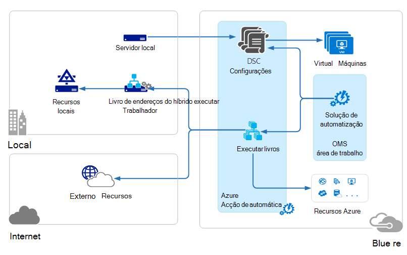

<properties 
   pageTitle="Arquitetura de gestão conjunto de aplicações (OMS) operações | Microsoft Azure"
   description="Microsoft operações de gestão de conjunto de aplicações (OMS) é baseado na nuvem IT solução de gestão da Microsoft de que o ajuda a gerir e proteger o seu no local e na nuvem infraestrutura.  Este artigo identifica os diferentes serviços incluídos no OMS e fornece ligações para aos respetivos conteúdos detalhadas."
   services="operations-management-suite"
   documentationCenter=""
   authors="bwren"
   manager="jwhit"
   editor="tysonn" />
<tags 
   ms.service="operations-management-suite"
   ms.devlang="na"
   ms.topic="get-started-article"
   ms.tgt_pltfrm="na"
   ms.workload="infrastructure-services"
   ms.date="10/27/2016"
   ms.author="bwren" />

# Arquitetura OMS

[Conjunto de aplicações de gestão de operações (OMS)](https://azure.microsoft.com/documentation/services/operations-management-suite/) é uma coleção de serviços baseado na nuvem para gerir o seu no local e na nuvem ambientes.  Este artigo descreve a diferente no local e na nuvem componentes de OMS e os respetivos arquitetura de computação de alto nuvem nível.  Pode consultar a documentação para cada serviço para obter mais detalhes.

## Análise de registo

Todos os dados recolhidos pela [Análise de registo](https://azure.microsoft.com/documentation/services/log-analytics/) está armazenado no repositório OMS que está alojado no Azure.  Origens ligadas geram os dados recolhidos para o repositório OMS.  Existem três tipos de origens ligadas suportados.

- Um agent instalado no computador [Windows](../log-analytics/log-analytics-windows-agents.md) ou [Linux](../log-analytics/log-analytics-linux-agents.md) ligado diretamente ao OMS.
- Um Gestor de operações de centro do sistema (SCOM) gestão grupo [ligado a análise de registo](../log-analytics/log-analytics-om-agents.md) .  Agentes SCOM continuam a comunicar com servidores de gestão reencaminhar eventos e dados de desempenho para a análise de registo.
- Uma [conta de armazenamento Azure](../log-analytics/log-analytics-azure-storage.md) que recolhe [Azure diagnóstico](../cloud-services/cloud-services-dotnet-diagnostics.md) dados a partir de uma função de trabalho, função web ou máquina virtual no Azure.

Origens de dados definem os dados que o registo de análise recolhe a partir de origens ligadas, incluindo registos dos eventos e contadores de desempenho.  Soluções de adicionam a funcionalidade a OMS e facilmente podem ser adicionadas à área de trabalho a partir da [Galeria de soluções OMS](../log-analytics/log-analytics-add-solutions.md).  Algumas soluções podem exigir uma ligação direta para a análise de registo do agentes SCOM enquanto outras pessoas podem exigir um agente adicional para ser instalado.

Análise de registo tem um portal baseado na web que pode utilizar a gestão de recursos OMS, adicionar e configurar soluções OMS e ver e analisar dados no repositório de OMS.

## Automatização Azure

[Azure automatização runbooks](http://azure.microsoft.com/documentation/services/automation) são executados na nuvem Azure e pode aceder a recursos que estão no Azure, noutros serviços na nuvem ou acessível a partir da Internet pública.  Também pode designar máquinas no local no Centro de dados locais utilizando [Híbrido livro execuções trabalho](../automation/automation-hybrid-runbook-worker.md) para que runbooks pode aceder a recursos locais.

[Configurações de DSC](../automation/automation-dsc-overview.md) armazenadas no Azure automatização podem ser aplicadas diretamente a máquinas virtuais Azure.  Outros física e máquinas virtuais pode pedir configurações do servidor de solicitação Azure automatização DSC.

Automatização Azure tem uma solução OMS que apresenta as estatísticas e ligações para iniciar o Azure portal para quaisquer operações.

## Cópia de segurança do Azure

Dados protegidos em [Cópia de segurança do Azure](http://azure.microsoft.com/documentation/services/backup) são armazenados num cofre cópia de segurança localizado numa região geográfica específica.  Os dados são replicados dentro da mesma região e, dependendo do tipo de cofre, também podem ser replicados para outro região para redundância ainda mais.

Cópia de segurança do Azure tem três cenários fundamentais.

- Máquina do Windows com o agente de cópia de segurança do Azure.  Esta opção permite-lhe a cópia de segurança ficheiros e pastas a partir de qualquer Windows server ou cliente diretamente para o Azure cofre cópia de segurança.  
- Gestor de proteção de dados do sistema centro (DPM) ou servidor de cópia de segurança do Microsoft Azure. Esta opção permite-lhe tirar partido DPM ou servidor de cópia de segurança do Microsoft Azure para cópia de segurança de ficheiros e pastas, para além da aplicação das cargas de trabalho como SQL e o SharePoint para o armazenamento local e, em seguida, criar uma réplica da sua Azure cofre cópia de segurança.
- Extensões de Máquina Virtual Azure.  Esta opção permite-lhe fazer cópia de segurança Azure máquinas virtuais para Cofre de cópia de segurança Azure.

Cópia de segurança do Azure tem uma solução OMS que apresenta as estatísticas e ligações para iniciar o Azure portal para quaisquer operações.

## Recuperação de Azure Site

[Recuperação de sites do Azure](http://azure.microsoft.com/documentation/services/site-recovery) orquestra replicação, activação e reposição de recurso de máquinas virtuais e servidores físicos. Dados de replicação são trocados entre anfitriões Hyper-V, VMware hypervisors e servidores físicos na principais e secundários centros de dados ou entre o Centro de dados e o Azure armazenamento.  Recuperação de sites armazena metadados em cofres localizados numa determinada região geográfica Azure. Sem dados replicados são armazenados pelo serviço recuperação de sites.

Recuperação de Site Azure tem três cenários de replicação fundamentais.

**Replicação de máquinas virtuais de Hyper-V**
- Se forem geridas máquinas virtuais de Hyper-V no nuvens VMM, pode criar uma réplica para um centro de dados secundária ou ao armazenamento Azure.  A replicação para o Azure é através de uma ligação à internet seguro.  A replicação para um centro de dados secundária é através da rede local.
- Se máquinas virtuais de Hyper-V não são geridas pelo VMM, pode criar uma réplica ao armazenamento Azure apenas.  A replicação para o Azure é através de uma ligação à internet seguro.
 
**Replicação de máquinas virtuais de VMWare**
- Pode criar uma réplica máquinas virtuais de VMware para um centro de dados secundário executar VMware ou ao armazenamento Azure.  Pode ocorrer a replicação para Azure através de um site para o site VPN ou Azure ExpressRoute ou através de uma ligação à Internet segura. A replicação para um centro de dados secundária ocorre através do canal de dados InMage Scout.
 
**Replicação dos servidores Windows e Linux físicas** 
- Pode criar uma réplica servidores físicos para um centro de dados secundário ou ao armazenamento Azure. Pode ocorrer a replicação para Azure através de um site para o site VPN ou Azure ExpressRoute ou através de uma ligação à Internet segura. A replicação para um centro de dados secundária ocorre através do canal de dados InMage Scout.  Recuperação de Site Azure tem uma solução OMS apresenta alguns estatísticas, mas tem de utilizar o portal do Azure para quaisquer operações.

## Próximos passos

- Saiba mais sobre [a análise de registo](http://azure.microsoft.com/documentation/services/log-analytics).
- Saiba mais sobre [Automatização Azure](https://azure.microsoft.com/documentation/services/automation).
- Saiba mais sobre a [cópia de segurança do Azure](http://azure.microsoft.com/documentation/services/backup).
- Saiba mais sobre [recuperação Azure de sites](http://azure.microsoft.com/documentation/services/site-recovery).
