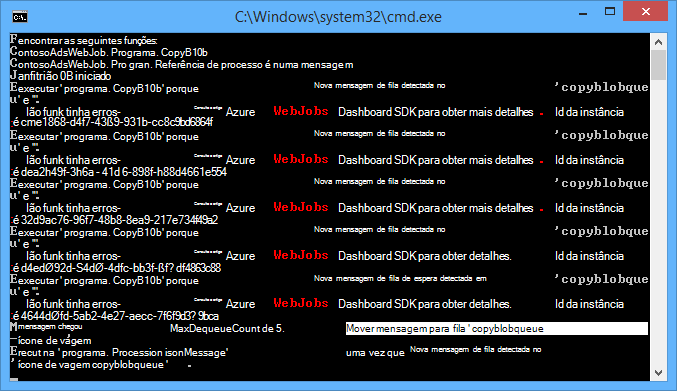
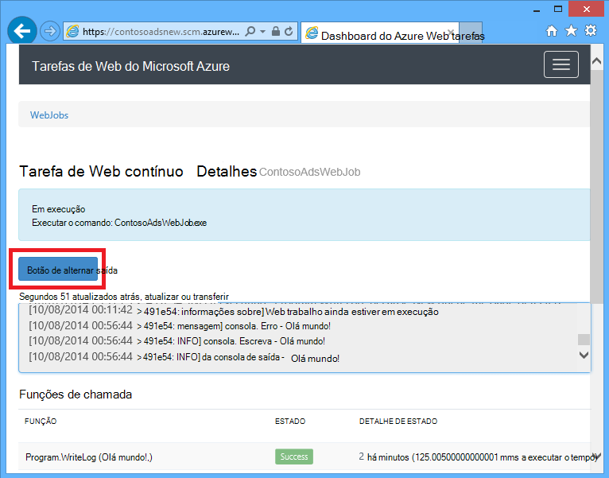
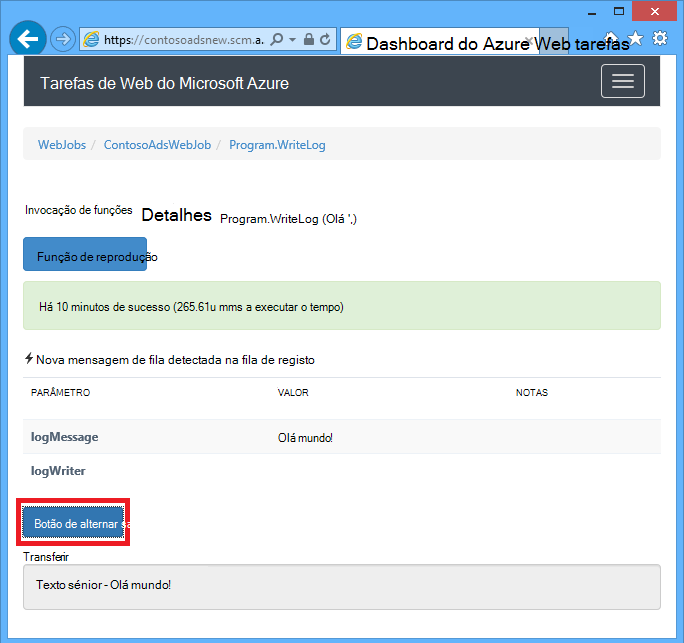
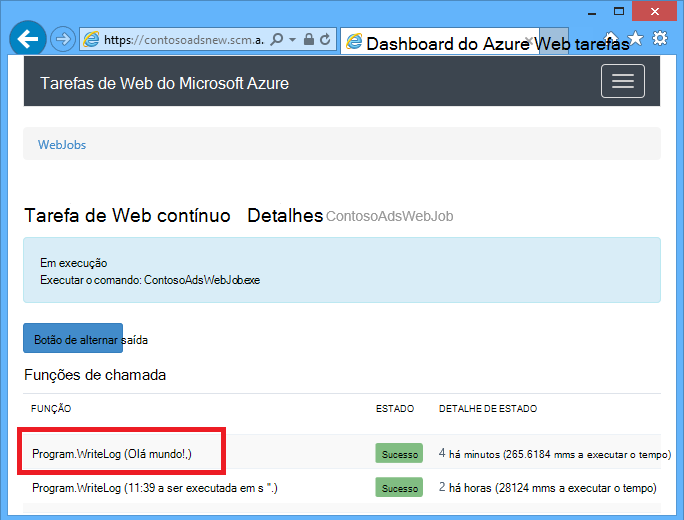
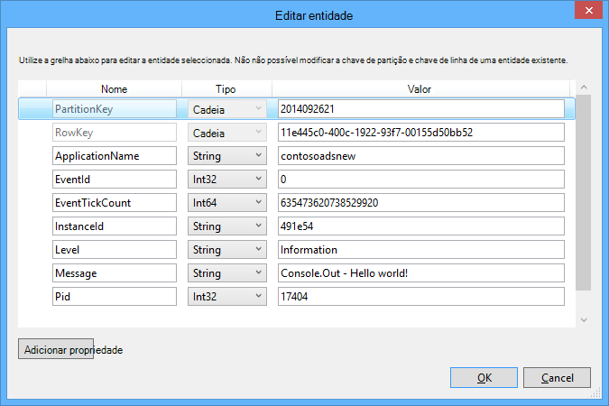
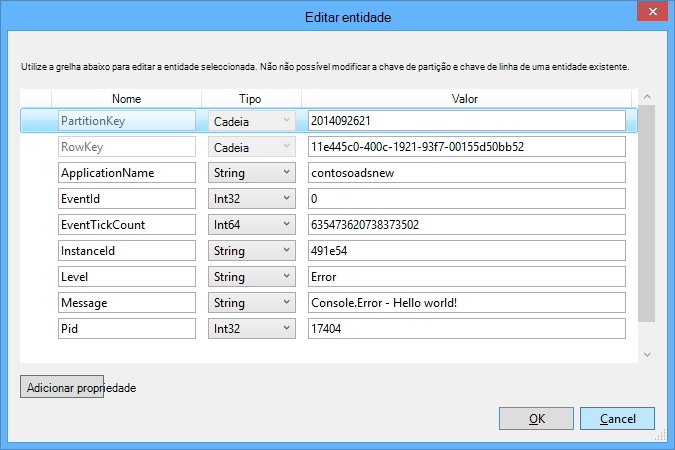

<properties
    pageTitle="Introdução ao armazenamento de fila de espera e Visual Studio ligado serviços (WebJob projetos) | Microsoft Azure"
    description="Como começar a utilizar o armazenamento de Azure filas num projeto WebJob após ligar a uma conta de armazenamento utilizando o Visual Studio ligado serviços."
    services="storage"
    documentationCenter=""
    authors="TomArcher"
    manager="douge"
    editor=""/>

<tags
    ms.service="storage"
    ms.workload="web"
    ms.tgt_pltfrm="vs-getting-started"
    ms.devlang="na"
    ms.topic="article"
    ms.date="07/18/2016"
    ms.author="tarcher"/>

# Introdução ao armazenamento de Azure fila de espera e Visual Studio ligado serviços (WebJob projetos)

[AZURE.INCLUDE [storage-try-azure-tools-queues](../../includes/storage-try-azure-tools-queues.md)]

## Descrição geral

Este artigo descreve como começar a utilizar o armazenamento de Azure filas num projeto do Visual Studio Azure WebJob depois de ter criado ou referenciada uma conta de armazenamento Azure utilizando a caixa de diálogo do Visual Studio **Adicionar serviços ligados** . Quando adicionar uma conta de armazenamento a um projeto WebJob utilizando a caixa de diálogo do Visual Studio **Adicionar serviços ligados** , os pacotes de Azure armazenamento NuGet adequados estão instalados, as referências de .NET adequadas são adicionadas ao projeto e são atualizadas as cadeias de ligação para a conta de armazenamento no ficheiro App.  

Este artigo fornece c# exemplos de código que mostram como utilizar a versão do Azure WebJobs SDK 1. x com o serviço de armazenamento do Azure fila de espera.

Armazenamento de fila Azure é um serviço para armazenar grandes quantidades de mensagens que podem ser acedidas a partir de qualquer parte do mundo através de chamadas autenticadas utilizando HTTP ou HTTPS. Uma mensagem de fila única pode ter até 64 KB de tamanho e uma fila pode conter milhões de mensagens, por excesso para o limite de capacidade total de uma conta de armazenamento. Para obter mais informações, consulte a [Introdução ao armazenamento de fila de espera do Windows Azure utilizando o .NET](storage-dotnet-how-to-use-queues.md) . Para mais informações sobre o ASP.NET, consulte o artigo [ASP.NET](http://www.asp.net).

## Como acionar uma função quando for recebida uma mensagem de fila de espera

Para escrever uma função que o SDK WebJobs chamadas quando for recebida uma mensagem de fila de espera, utilize o atributo **QueueTrigger** . O construtor de atributo leva um parâmetro de cadeia que especifica o nome da fila de espera para as de inquérito. Para ver como definir o nome da fila dinamicamente, consulte o artigo [como definir opções de configuração](#how-to-set-configuration-options).

### Mensagens em fila cadeia

No exemplo seguinte, o fila de espera contém uma mensagem de cadeia, por isso **QueueTrigger** é aplicado a um parâmetro de cadeia com o nome **logMessage** que contém os conteúdos da mensagem fila de espera. A função [escreve uma mensagem de registo para o Dashboard](#how-to-write-logs).

        public static void ProcessQueueMessage([QueueTrigger("logqueue")] string logMessage, TextWriter logger)
        {
            logger.WriteLine(logMessage);
        }

Para além de **cadeia**, o parâmetro pode ser uma matriz de bytes, um objeto de **CloudQueueMessage** ou um POCO definidos por si.

### POCO [(simples objecto CLR antigo](http://en.wikipedia.org/wiki/Plain_Old_CLR_Object)) fila de mensagens

No seguinte exemplo, a mensagem de fila contém JSON de um objeto de **BlobInformation** que inclui uma propriedade **BlobName** . O SDK deserializes automaticamente o objeto.

        public static void WriteLogPOCO([QueueTrigger("logqueue")] BlobInformation blobInfo, TextWriter logger)
        {
            logger.WriteLine("Queue message refers to blob: " + blobInfo.BlobName);
        }

O SDK utiliza o [pacote de Newtonsoft.Json NuGet](http://www.nuget.org/packages/Newtonsoft.Json) serializar e serialização de mensagens. Se criar mensagens em fila num programa que não utiliza o SDK WebJobs, pode escrever código semelhante ao exemplo seguinte para criar uma mensagem de fila POCO o SDK pode analisar.

        BlobInformation blobInfo = new BlobInformation() { BlobName = "log.txt" };
        var queueMessage = new CloudQueueMessage(JsonConvert.SerializeObject(blobInfo));
        logQueue.AddMessage(queueMessage);

### Funções de assíncrona

A seguinte assíncrona função [escreve um registo para o Dashboard](#how-to-write-logs).

        public async static Task ProcessQueueMessageAsync([QueueTrigger("logqueue")] string logMessage, TextWriter logger)
        {
            await logger.WriteLineAsync(logMessage);
        }

Funções assíncronas poderão demorar um [token de cancelamento](http://www.asp.net/mvc/overview/performance/using-asynchronous-methods-in-aspnet-mvc-4#CancelToken), conforme mostrado no seguinte exemplo copia um blob. (Para obter uma explicação do marcador de posição **queueTrigger** , consulte a secção [Blobs](#how-to-read-and-write-blobs-and-tables-while-processing-a-queue-message) ).

        public async static Task ProcessQueueMessageAsyncCancellationToken(
            [QueueTrigger("blobcopyqueue")] string blobName,
            [Blob("textblobs/{queueTrigger}",FileAccess.Read)] Stream blobInput,
            [Blob("textblobs/{queueTrigger}-new",FileAccess.Write)] Stream blobOutput,
            CancellationToken token)
        {
            await blobInput.CopyToAsync(blobOutput, 4096, token);
        }

## Tipos do que atributo QueueTrigger funciona com

Pode utilizar **QueueTrigger** com os seguintes tipos:

* **cadeia**
* Um tipo POCO serializado como JSON
* **byte]**
* **CloudQueueMessage**

## Algoritmo de inquérito

O SDK implementa um aleatório exponencial back-off algoritmo para reduzir o efeito de fila idle custos da transação de armazenamento de consulta.  Quando uma mensagem for encontrada, o SDK aguarda dois segundos e, em seguida, verifica a existência de outra mensagem; Quando não for encontrada nenhuma mensagem aguarda cerca de quatro segundos antes de tentar novamente. Após tentativas falhadas subsequentes para obter uma mensagem de fila de espera, o tempo de espera continua aumentar até atingir o tempo máximo de espera, que assume a um minuto. [O tempo de espera máximo é configurável](#how-to-set-configuration-options).

## Várias instâncias

Se a aplicação web é executado em várias instâncias, um WebJobs contínuo é executado em cada máquina e cada máquina irá aguardar accionadores e tentará executar funções. Em alguns cenários que isto pode levar a algumas funções processamento os mesmos dados duas vezes, por isso, funções deverá idempotent (escrito para que chamá-los repetidamente com os mesmos dados de entrada não produzir resultados duplicados).  

## Execução paralela

Se tiver várias funções escutar filas diferentes, o SDK ligarem-los em paralelo quando mensagens são recebidas em simultâneo.

O mesmo é verdadeiro quando várias mensagens são recebidas para uma única fila. Por predefinição, o SDK obtém um lote de 16 mensagens da fila uma vez e executa a função que processa-los em paralelo. [O tamanho do lote é configurável](#how-to-set-configuration-options). Quando obtém o número a ser processado para baixo a metade do tamanho do lote, o SDK obtém outra secção e inicia o processamento dessas mensagens. Por conseguinte, o número máximo de mensagens em simultâneo a ser processadas por função é uma vez e meia o lote tamanho. Este limite aplica-se separadamente para cada função que tiver um atributo **QueueTrigger** . Se não quiser execução paralela para mensagens recebidas numa fila, defina o tamanho do lote como 1.

## Obter fila ou metadados da mensagem de fila de espera

Pode obter as seguintes propriedades de mensagem ao adicionar parâmetros a assinatura método:

* **DateTimeOffset** expirationTime
* **DateTimeOffset** insertionTime
* **DateTimeOffset** nextVisibleTime
* queueTrigger de **cadeia** (contém o texto da mensagem)
* id da **cadeia**
* **cadeia** popReceipt
* **int** dequeueCount

Se pretender trabalhe diretamente com o Azure armazenamento API, também pode adicionar um parâmetro **CloudStorageAccount** .

O exemplo seguinte escreve todas este metadados a um registo da aplicação de informações. No exemplo, logMessage e queueTrigger contêm o conteúdo da mensagem fila de espera.

        public static void WriteLog([QueueTrigger("logqueue")] string logMessage,
            DateTimeOffset expirationTime,
            DateTimeOffset insertionTime,
            DateTimeOffset nextVisibleTime,
            string id,
            string popReceipt,
            int dequeueCount,
            string queueTrigger,
            CloudStorageAccount cloudStorageAccount,
            TextWriter logger)
        {
            logger.WriteLine(
                "logMessage={0}\n" +
            "expirationTime={1}\ninsertionTime={2}\n" +
                "nextVisibleTime={3}\n" +
                "id={4}\npopReceipt={5}\ndequeueCount={6}\n" +
                "queue endpoint={7} queueTrigger={8}",
                logMessage, expirationTime,
                insertionTime,
                nextVisibleTime, id,
                popReceipt, dequeueCount,
                cloudStorageAccount.QueueEndpoint,
                queueTrigger);
        }

Eis um exemplo de registo escrito pelo código de exemplo:

        logMessage=Hello world!
        expirationTime=10/14/2014 10:31:04 PM +00:00
        insertionTime=10/7/2014 10:31:04 PM +00:00
        nextVisibleTime=10/7/2014 10:41:23 PM +00:00
        id=262e49cd-26d3-4303-ae88-33baf8796d91
        popReceipt=AgAAAAMAAAAAAAAAfc9H0n/izwE=
        dequeueCount=1
        queue endpoint=https://contosoads.queue.core.windows.net/
        queueTrigger=Hello world!

## Desligar sem problemas

Uma função que é executado num WebJob contínua pode aceitar um parâmetro de **CancellationToken** que permite que o sistema operativo para a função o notifique quando o WebJob está prestes a ser terminadas. Pode utilizar esta notificação para se certificar de que a função não termina inesperadamente de uma forma que torna os dados num estado inconsistente.

O exemplo seguinte mostra como verificar a existência de iminente WebJob taxas de cessação numa função.

    public static void GracefulShutdownDemo(
                [QueueTrigger("inputqueue")] string inputText,
                TextWriter logger,
                CancellationToken token)
    {
        for (int i = 0; i < 100; i++)
        {
            if (token.IsCancellationRequested)
            {
                logger.WriteLine("Function was cancelled at iteration {0}", i);
                break;
            }
            Thread.Sleep(1000);
            logger.WriteLine("Normal processing for queue message={0}", inputText);
        }
    }

**Nota:** O Dashboard não poderá mostrar corretamente o estado e o resultado de funções que ter sido encerrada.

Para mais informações, consulte o artigo [WebJobs com êxito encerramento](http://blog.amitapple.com/post/2014/05/webjobs-graceful-shutdown/#.VCt1GXl0wpR).   

## Como criar uma mensagem de fila de espera durante o processamento de uma mensagem de fila de espera

Para escrever uma função que cria uma nova mensagem de fila de espera, utilize o atributo **fila de espera** . Como **QueueTrigger**, passar no nome da fila de espera, como uma cadeia ou pode [definir o nome da fila dinamicamente](#how-to-set-configuration-options).

### Mensagens em fila cadeia

O exemplo seguinte de código que não sejam assíncrona cria uma nova mensagem de fila de espera na fila de espera com o nome "outputqueue" com o mesmo conteúdo como a mensagem de fila recebida na fila de espera com o nome "inputqueue". (Assíncrona utilizam funções **IAsyncCollector<T> ** conforme mostrado mais tarde nesta secção.)

        public static void CreateQueueMessage(
            [QueueTrigger("inputqueue")] string queueMessage,
            [Queue("outputqueue")] out string outputQueueMessage )
        {
            outputQueueMessage = queueMessage;
        }

### POCO [(simples objecto CLR antigo](http://en.wikipedia.org/wiki/Plain_Old_CLR_Object)) fila de mensagens

Para criar uma mensagem de fila de espera que contenha uma POCO em vez de uma cadeia, passe o tipo POCO como um parâmetro de saída para o construtor de atributo **fila de espera** .

        public static void CreateQueueMessage(
            [QueueTrigger("inputqueue")] BlobInformation blobInfoInput,
            [Queue("outputqueue")] out BlobInformation blobInfoOutput )
        {
            blobInfoOutput = blobInfoInput;
        }

O SDK serializes automaticamente o objeto para JSON. É criada sempre uma mensagem de fila de espera, mesmo se o objeto é nulo.

### Criar múltiplas mensagens ou nas funções assíncrona

Para criar várias mensagens, tornar o tipo de parâmetro para a fila de saída **ICollector<T> ** ou **IAsyncCollector<T>**, conforme mostrado no seguinte exemplo.

        public static void CreateQueueMessages(
            [QueueTrigger("inputqueue")] string queueMessage,
            [Queue("outputqueue")] ICollector<string> outputQueueMessage,
            TextWriter logger)
        {
            logger.WriteLine("Creating 2 messages in outputqueue");
            outputQueueMessage.Add(queueMessage + "1");
            outputQueueMessage.Add(queueMessage + "2");
        }

Cada mensagem fila é criada imediatamente quando chama-se o método **Adicionar** .

### Tipos de que o atributo fila funciona com

Pode utilizar o atributo **fila** nos seguintes tipos de parâmetro:

* **saída cadeia** (cria mensagem fila de espera, se o valor do parâmetro é não nulas quando termina a função)
* **saída byte]** (funciona como **cadeia**)
* **saída CloudQueueMessage** (funciona como **cadeia**)
* **saída POCO** (um tipo serializável, cria uma mensagem com um objecto nulo se o parâmetro é nulo quando termina a função)
* **ICollector**
* **IAsyncCollector**
* **CloudQueue** (para criar manualmente a mensagens de utilizar a API do armazenamento Azure diretamente)

### Utilize os atributos de WebJobs SDK no corpo de uma função

Se precisar de fazer algumas trabalho na sua função antes de utilizar um atributo WebJobs SDK como **fila de espera**, **BLOBs**ou **tabela**, pode utilizar a interface de **IBinder** .

O exemplo seguinte utiliza uma mensagem de fila de entrada e cria uma nova mensagem com o mesmo conteúdo de uma fila de saída. O nome da fila de saída é definido pelo código no corpo da função.

        public static void CreateQueueMessage(
            [QueueTrigger("inputqueue")] string queueMessage,
            IBinder binder)
        {
            string outputQueueName = "outputqueue" + DateTime.Now.Month.ToString();
            QueueAttribute queueAttribute = new QueueAttribute(outputQueueName);
            CloudQueue outputQueue = binder.Bind<CloudQueue>(queueAttribute);
            outputQueue.AddMessage(new CloudQueueMessage(queueMessage));
        }

A interface de **IBinder** pode também ser utilizada com os atributos de **tabela** e **Blob** .

## Como ler e escrever blobs e tabelas durante o processamento de uma mensagem de fila de espera

Os atributos de **BLOBs** e **tabela** permitem-lhe ler e escrever blobs e tabelas. Os exemplos nesta secção aplicam-se para blobs. Para obter exemplos de código que mostram como acionar processos quando blobs são criadas ou atualizadas, veja [como utilizar o armazenamento de Blobs do Azure com o SDK WebJobs](../app-service-web/websites-dotnet-webjobs-sdk-storage-blobs-how-to.md)e para os exemplos de código que ler e escrever tabelas, consulte o artigo [como utilizar o armazenamento de tabela do Azure com o SDK WebJobs](../app-service-web/websites-dotnet-webjobs-sdk-storage-tables-how-to.md).

### Mensagens em fila acionar blob operações de cadeia

Para uma mensagem de fila de espera que contém uma cadeia, **queueTrigger** é um marcador de posição que pode utilizar no parâmetro de **blobPath** o atributo **Blob** que contém os conteúdos da mensagem.

O exemplo seguinte utiliza a **sequência de** objetos para ler e escrever blobs. A mensagem de fila é o nome de um blob localizado no contentor de textblobs. Uma cópia do blob com "-novo" acrescentado ao nome é criado no mesmo contentor.

        public static void ProcessQueueMessage(
            [QueueTrigger("blobcopyqueue")] string blobName,
            [Blob("textblobs/{queueTrigger}",FileAccess.Read)] Stream blobInput,
            [Blob("textblobs/{queueTrigger}-new",FileAccess.Write)] Stream blobOutput)
        {
            blobInput.CopyTo(blobOutput, 4096);
        }

O construtor de atributo **Blob** leva um parâmetro de **blobPath** que especifica o contentor e o nome de Blobs. Para mais informações sobre este marcador de posição, consulte o artigo [como utilizar o armazenamento de Blobs do Azure com o SDK WebJobs](../app-service-web/websites-dotnet-webjobs-sdk-storage-blobs-how-to.md).

Quando o atributo decora um objeto de **sequência** , outro construtor parâmetro especifica o modo de **FileAccess** como ler, escrever ou leitura/escrita.

O exemplo seguinte utiliza um objeto de **CloudBlockBlob** para eliminar um blob. A mensagem de fila é o nome do blob.

        public static void DeleteBlob(
            [QueueTrigger("deleteblobqueue")] string blobName,
            [Blob("textblobs/{queueTrigger}")] CloudBlockBlob blobToDelete)
        {
            blobToDelete.Delete();
        }

### POCO [(simples objecto CLR antigo](http://en.wikipedia.org/wiki/Plain_Old_CLR_Object)) fila de mensagens

Para um POCO armazenado como JSON na mensagem de fila de espera, pode de utilizar a marcadores de posição que propriedades do nome do objeto no parâmetro de **blobPath** o atributo **fila de espera** . Também pode utilizar os nomes de propriedades de metadados fila como marcadores de posição. Consulte o artigo [obter fila ou metadados da mensagem de fila de espera](#get-queue-or-queue-message-metadata).

O exemplo seguinte copia um blob para um novo blob com uma extensão diferente. A mensagem de fila é um objeto de **BlobInformation** incluem propriedades **BlobName** e **BlobNameWithoutExtension** . Os nomes das propriedades são utilizados como marcadores de posição no caminho blob para os atributos de **BLOBs** .

        public static void CopyBlobPOCO(
            [QueueTrigger("copyblobqueue")] BlobInformation blobInfo,
            [Blob("textblobs/{BlobName}", FileAccess.Read)] Stream blobInput,
            [Blob("textblobs/{BlobNameWithoutExtension}.txt", FileAccess.Write)] Stream blobOutput)
        {
            blobInput.CopyTo(blobOutput, 4096);
        }

O SDK utiliza o [pacote de Newtonsoft.Json NuGet](http://www.nuget.org/packages/Newtonsoft.Json) serializar e serialização de mensagens. Se criar mensagens em fila num programa que não utiliza o SDK WebJobs, pode escrever código semelhante ao exemplo seguinte para criar uma mensagem de fila POCO o SDK pode analisar.

        BlobInformation blobInfo = new BlobInformation() { BlobName = "boot.log", BlobNameWithoutExtension = "boot" };
        var queueMessage = new CloudQueueMessage(JsonConvert.SerializeObject(blobInfo));
        logQueue.AddMessage(queueMessage);

Se precisar de fazer algumas trabalho na sua função antes de vincular um blob a um objeto, pode utilizar o atributo no corpo da função, conforme apresentado na [utilizar SDK WebJobs atributos no corpo de uma função](#use-webjobs-sdk-attributes-in-the-body-of-a-function).

###Tipos de que pode utilizar o atributo Blob com

O atributo **BLOBs** pode ser utilizado com os seguintes tipos:

* **Sequência** (leitura ou escrita, especificado utilizando o parâmetro do construtor de FileAccess)
* **TextReader**
* **TextWriter**
* **cadeia** (de leitura)
* **saída cadeia** (escrever; cria um blob apenas se o parâmetro de cadeia é não nulas quando a função devolve)
* POCO (de leitura)
* saída POCO (escrever; sempre cria um blob, cria como objeto nulo se POCO parâmetro é nulo quando a função devolve)
* **CloudBlobStream** (escrita)
* **ICloudBlob** (leitura ou escrita)
* **CloudBlockBlob** (leitura ou escrita)
* **CloudPageBlob** (leitura ou escrita)

##Como lidar com mensagens corrompida foi

Mensagens cujo conteúdo faz com que uma função a falha chamam *corrompida foi mensagens*. Quando a função falha, a mensagem de fila de espera não é eliminada e eventualmente é recolhida novamente, a causar o ciclo de ser repetida. O SDK automaticamente pode interromper o ciclo de depois de um número limitado de iterações ou pode fazê-lo manualmente.

### Processamento automático mensagem corrompida foi

O SDK ligarem uma função até 5 vezes para processar uma mensagem de fila de espera. Se o experimentar quinto falhar, a mensagem é movida para uma fila corrompida foi. Pode ver como configurar o número máximo de tentativas no [como definir opções de configuração](#how-to-set-configuration-options).

Fila de espera corrompida foi chama-se *{originalqueuename}*-corrompida foi. Pode escrever é necessária uma função para processar mensagens da fila corrompida foi ao registo-los ou ao enviar uma notificação a esse atenção manual.

No exemplo seguinte a **CopyBlob** função falhará quando uma mensagem de fila contém o nome de um blob que não existe. Quando o que acontece, a mensagem é movida da copyblobqueue fila de espera para a fila copyblobqueue poison. O **ProcessPoisonMessage** regista, em seguida, a mensagem corrompida foi.

        public static void CopyBlob(
            [QueueTrigger("copyblobqueue")] string blobName,
            [Blob("textblobs/{queueTrigger}", FileAccess.Read)] Stream blobInput,
            [Blob("textblobs/{queueTrigger}-new", FileAccess.Write)] Stream blobOutput)
        {
            blobInput.CopyTo(blobOutput, 4096);
        }

        public static void ProcessPoisonMessage(
            [QueueTrigger("copyblobqueue-poison")] string blobName, TextWriter logger)
        {
            logger.WriteLine("Failed to copy blob, name=" + blobName);
        }

A ilustração seguinte mostra a saída de consola destas funções quando uma mensagem corrompida é processada.

### Processamento de mensagem corrompida foi manual

Pode obter o número de vezes que uma mensagem ter sido recolhida para cima para processamento ao adicionar um parâmetro de **int** **dequeueCount** a sua função com o nome. Em seguida, pode verificar a contagem de fila no código de função e executar a sua própria mensagem corrompida foi processamento quando o número exceder um limite, conforme mostrado no seguinte exemplo.

        public static void CopyBlob(
            [QueueTrigger("copyblobqueue")] string blobName, int dequeueCount,
            [Blob("textblobs/{queueTrigger}", FileAccess.Read)] Stream blobInput,
            [Blob("textblobs/{queueTrigger}-new", FileAccess.Write)] Stream blobOutput,
            TextWriter logger)
        {
            if (dequeueCount > 3)
            {
                logger.WriteLine("Failed to copy blob, name=" + blobName);
            }
            else
            {
            blobInput.CopyTo(blobOutput, 4096);
            }
        }

## Como definir opções de configuração

Pode utilizar o tipo de **JobHostConfiguration** para definir as opções de configuração seguintes:

* Defina as cadeias de ligação SDK no código.
* Configurar **QueueTrigger** definições como máximo descarregado contagem.
* Obter nomes de fila de configuração.

###Definir as cadeias de ligação SDK no código

Definir as cadeias de ligação SDK no código permite-lhe utilizar o seus próprio nomes de cadeia de ligação em ficheiros de configuração ou variáveis de ambiente, conforme mostrado no seguinte exemplo.

        static void Main(string[] args)
        {
            var _storageConn = ConfigurationManager
                .ConnectionStrings["MyStorageConnection"].ConnectionString;

            var _dashboardConn = ConfigurationManager
                .ConnectionStrings["MyDashboardConnection"].ConnectionString;

            var _serviceBusConn = ConfigurationManager
                .ConnectionStrings["MyServiceBusConnection"].ConnectionString;

            JobHostConfiguration config = new JobHostConfiguration();
            config.StorageConnectionString = _storageConn;
            config.DashboardConnectionString = _dashboardConn;
            config.ServiceBusConnectionString = _serviceBusConn;
            JobHost host = new JobHost(config);
            host.RunAndBlock();
        }

### Configurar definições de QueueTrigger

Pode configurar as seguintes definições aplicam-se para o processamento fila de espera da mensagem:

- O número máximo de mensagens da fila que são recolhidas para cima em simultâneo para ser executada em paralelo (a predefinição é 16).
- O número máximo de tentativas antes de uma mensagem de fila é enviada para uma fila corrompida foi (a predefinição é 5).
- Máximo de tempo antes de consulta novamente quando estiver em branco uma fila de espera (a predefinição é 1 minuto).

O exemplo seguinte mostra como configurar estas definições:

        static void Main(string[] args)
        {
            JobHostConfiguration config = new JobHostConfiguration();
            config.Queues.BatchSize = 8;
            config.Queues.MaxDequeueCount = 4;
            config.Queues.MaxPollingInterval = TimeSpan.FromSeconds(15);
            JobHost host = new JobHost(config);
            host.RunAndBlock();
        }

### Valores definidos para WebJobs SDK parâmetros construtor no código

Por vezes, pretende especificar um nome de fila de espera, um nome de BLOBs ou contentor ou uma tabela-lhe o nome do código em vez de código de disco rígido. Por exemplo, poderá pretender especificar o nome da fila para **QueueTrigger** numa variável de ficheiro ou ambiente de configuração.

Pode fazê-lo fazendo passagem num objeto **NameResolver** com o tipo de **JobHostConfiguration** . Incluir marcadores de posição especiais rodeadas por sinais de percentagem (%)) nos parâmetros de construtor de atributo WebJobs SDK e o código de **NameResolver** Especifica os valores reais para ser utilizadas para substituir os marcadores de posição.

Por exemplo, imaginemos que pretende utilizar uma fila com o nome logqueuetest no ambiente de teste e um logqueueprod com nome de produção. Em vez de um nome codificado fila de espera, que pretende especificar o nome de uma entrada na coleção de **appSettings** que teria o nome da fila real. Se a chave de **appSettings** for logqueue, a função pode aspeto o exemplo seguinte.

        public static void WriteLog([QueueTrigger("%logqueue%")] string logMessage)
        {
            Console.WriteLine(logMessage);
        }

Sua aula **NameResolver** poderia obter o nome da fila de **appSettings** conforme mostrado no exemplo seguinte:

        public class QueueNameResolver : INameResolver
        {
            public string Resolve(string name)
            {
                return ConfigurationManager.AppSettings[name].ToString();
            }
        }

Passar a classe de **NameResolver** ao objeto **JobHost** conforme mostrado no seguinte exemplo.

        static void Main(string[] args)
        {
            JobHostConfiguration config = new JobHostConfiguration();
            config.NameResolver = new QueueNameResolver();
            JobHost host = new JobHost(config);
            host.RunAndBlock();
        }

**Nota:** Fila de espera, tabela e BLOBs nomes são resolvidos sempre uma função denomina-se, mas nomes do contentor BLOBs são resolvidos apenas quando a aplicação é iniciada. Não é possível alterar o nome do contentor blob enquanto a tarefa estiver em execução.

## Como acionar uma função manualmente

Para acionar uma função manualmente, utilize o método de **chamada** ou **CallAsync** sobre o objeto **JobHost** e o atributo **NoAutomaticTrigger** sobre a função, conforme mostrado no seguinte exemplo.

        public class Program
        {
            static void Main(string[] args)
            {
                JobHost host = new JobHost();
                host.Call(typeof(Program).GetMethod("CreateQueueMessage"), new { value = "Hello world!" });
            }

            [NoAutomaticTrigger]
            public static void CreateQueueMessage(
                TextWriter logger,
                string value,
                [Queue("outputqueue")] out string message)
            {
                message = value;
                logger.WriteLine("Creating queue message: ", message);
            }
        }

## Como escrever registos

O Dashboard mostra registos em dois lugares: a página para o WebJob e a página para uma determinada invocação de WebJob.

Saída de métodos de consola ligar para uma função ou o método **Main()** é apresentada na página de Dashboard para o WebJob e não na página para um determinado método de invocação. Saída do objeto TextWriter que obtém de um parâmetro na sua assinatura do método de aparece na página de Dashboard de um método de invocação.

Saída da consola não pode ser associada a um determinado método de invocação porque a consola é por única tópicos, enquanto muitas funções de tarefa podem estar em execução ao mesmo tempo. Razão pela qual o SDK fornece invocação cada função com as suas próprias objeto de sénior registo único.

Para escrever os [registos do rastreio de aplicação](web-sites-dotnet-troubleshoot-visual-studio.md#logsoverview), utilize **Console.Out** (cria os registos marcados como informações) e **Console.Error** (cria os registos assinalados como erro). Uma alternativa consiste em utilizar o [rastreio ou TraceSource](http://blogs.msdn.com/b/mcsuksoldev/archive/2014/09/04/adding-trace-to-azure-web-sites-and-web-jobs.aspx), que fornece níveis verboso, aviso e crítica além das informações e o erro. Registos de rastreio da aplicação apresentada nos ficheiros de registo de aplicação web, Azure tabelas, ou blobs do Azure dependendo de como configurar a sua aplicação Azure web. Como é verdadeira relativamente a todos os saída da consola, os registos da 100 aplicação mais recentes também são apresentados na página de Dashboard para WebJob, não a página para uma chamada de função.

Saída da consola é apresentado no Dashboard de apenas se o programa está em execução no WebJob Azure, não se o programa está a ser executado localmente ou algumas outras ambiente.

Pode desativar o registo definindo a cadeia de ligação de Dashboard nulo. Para mais informações, consulte o artigo [como definir opções de configuração](#how-to-set-configuration-options).

O exemplo seguinte mostra várias formas para escrever os registos:

        public static void WriteLog(
            [QueueTrigger("logqueue")] string logMessage,
            TextWriter logger)
        {
            Console.WriteLine("Console.Write - " + logMessage);
            Console.Out.WriteLine("Console.Out - " + logMessage);
            Console.Error.WriteLine("Console.Error - " + logMessage);
            logger.WriteLine("TextWriter - " + logMessage);
        }

No Dashboard de SDK WebJobs, o resultado do objeto **TextWriter** de aparece quando Ir para a página para uma chamada de função em particular e selecione o **Botão de alternar saída**:

No Dashboard de SDK WebJobs, as 100 linhas mais recentes da consola de saída Mostrar para cima quando Ir para a página para WebJob (não para invocação função) e selecione o **Botão de alternar saída**.

Num WebJob contínuo, registos de aplicações aparecem na/dados/tarefas/contínua /*{webjobname}*/job_log.txt no sistema de ficheiros de aplicação web.

        [09/26/2014 21:01:13 > 491e54: INFO] Console.Write - Hello world!
        [09/26/2014 21:01:13 > 491e54: ERR ] Console.Error - Hello world!
        [09/26/2014 21:01:13 > 491e54: INFO] Console.Out - Hello world!

Num Azure blob o aplicação registos têm este aspeto: 2014-09-26T21:01:13,Information,contosoadsnew,491e54,635473620738373502,0,17404,17,Console.Write - Olá mundo!, 2014-09-26T21:01:13,Error,contosoadsnew,491e54,635473620738373502,0,17404,19,Console.Error - Olá mundo!, 2014-09-26T21:01:13,Information,contosoadsnew,491e54,635473620738529920,0,17404,17,Console.Out - Olá a todos!,

E numa tabela do Azure os registos de **Console.Out** e **Console.Error** o seguinte aspeto:

##Próximos passos

Este artigo forneceu exemplos de código que mostram como lidar cenários comuns de trabalhar com filas Azure. Para obter mais informações sobre como utilizar Azure WebJobs e o SDK WebJobs, consulte o artigo [recursos de documentação Azure WebJobs](http://go.microsoft.com/fwlink/?linkid=390226).
