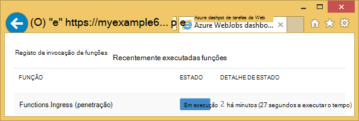
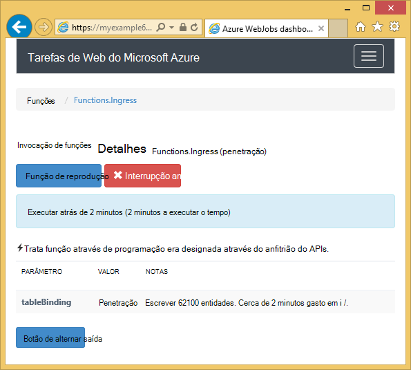
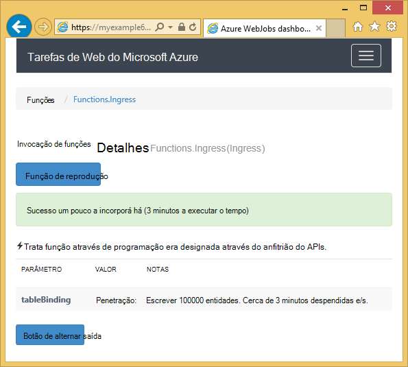

<properties
    pageTitle="Introdução ao Azure armazenamento e Visual Studio ligado serviços (WebJob projetos)"
    description="Como começar a utilizar o armazenamento de tabela do Azure num projeto Azure WebJobs no Visual Studio após ligar a uma conta de armazenamento utilizando o Visual Studio ligado serviços"
    services="storage"
    documentationCenter=""
    authors="TomArcher"
    manager="douge"
    editor=""/>

<tags
    ms.service="storage"
    ms.workload="web"
    ms.tgt_pltfrm="vs-getting-started"
    ms.devlang="na"
    ms.topic="article"
    ms.date="07/18/2016"
    ms.author="tarcher"/>

# Introdução ao Azure armazenamento (Azure WebJob projetos)

[AZURE.INCLUDE [storage-try-azure-tools-tables](../../includes/storage-try-azure-tools-tables.md)]

## Descrição geral

Este artigo fornece c# exemplos de código que mostram mostram como utilizar a versão do Azure WebJobs SDK 1. x com o serviço de armazenamento de tabela do Azure. Os exemplos de código de utilizar a versão de [WebJobs SDK](../app-service-web/websites-dotnet-webjobs-sdk.md) 1. x.

O serviço de armazenamento de tabela do Azure permite-lhe armazenar grandes quantidades de dados estruturados. O serviço é um arquivo de dados de NoSQL aceita autenticadas chamadas a partir do dentro e fora da nuvem Azure. Tabelas Azure são ideais para armazenar dados estruturados e não relacionais.  Para obter mais informações, consulte a [Introdução ao armazenamento de tabela do Azure utilizando o .NET](storage-dotnet-how-to-use-tables.md#create-a-table) .

Mostram algumas das fragmentos de código utilizado em funções que chamam manualmente, ou seja, não através de um dos atributos acionar o atributo de **tabela** .

## Como adicionar entidades a uma tabela

Para adicionar entidades a uma tabela, utilize o atributo **tabela** com um **ICollector<T> ** ou **IAsyncCollector<T> ** parâmetro onde **T** Especifica o esquema das entidades que pretende adicionar. O construtor de atributo leva um parâmetro de cadeia que especifica o nome da tabela.

O código de exemplo seguinte adiciona entidades de **pessoa** a uma tabela com o nome *penetração*.

        [NoAutomaticTrigger]
        public static void IngressDemo(
            [Table("Ingress")] ICollector<Person> tableBinding)
        {
            for (int i = 0; i < 100000; i++)
            {
                tableBinding.Add(
                    new Person() {
                        PartitionKey = "Test",
                        RowKey = i.ToString(),
                        Name = "Name" }
                    );
            }
        }

Normalmente, o tipo de que utilizar com **ICollector** deriva da **TableEntity** ou implementa **ITableEntity**, mas não tem a. Um dos seguintes classes de **pessoa** a trabalhar com o código apresentado no método de **penetração** anterior.

        public class Person : TableEntity
        {
            public string Name { get; set; }
        }

        public class Person
        {
            public string PartitionKey { get; set; }
            public string RowKey { get; set; }
            public string Name { get; set; }
        }

Se pretender trabalhe diretamente com o Azure armazenamento API, pode adicionar um parâmetro **CloudStorageAccount** a assinatura de método.

## Monitorização em tempo real

Uma vez que as funções de penetração de dados com frequência processam grandes volumes de dados, o dashboard WebJobs SDK fornece dados em tempo real de monitorização. A secção de **Registo de invocação** indica se a função ainda estiver em execução.

Página de **Detalhes de invocação** de relatórios progresso a função (número de entidades escritos) enquanto está a ser executado e fornece-lhe uma oportunidade para cancelá-lo.

Quando termina a função, página de **Detalhes de invocação** de relatórios o número de linhas por escrito.

## Saber como ler várias entidades de uma tabela

Para ler uma tabela, utilize o atributo **tabela** com um **IQueryable<T> ** parâmetro onde o tipo de **T** deriva da **TableEntity** ou implementa **ITableEntity**.

O código seguinte de exemplo lê e os registos de todas as linhas da tabela **penetração** :

        public static void ReadTable(
            [Table("Ingress")] IQueryable<Person> tableBinding,
            TextWriter logger)
        {
            var query = from p in tableBinding select p;
            foreach (Person person in query)
            {
                logger.WriteLine("PK:{0}, RK:{1}, Name:{2}",
                    person.PartitionKey, person.RowKey, person.Name);
            }
        }

### Saber como ler uma única entidade de uma tabela

Existe um construtor de atributo **tabela** com dois parâmetros adicionais que permitem-lhe especificar a chave de partição e chave de linha ao qual pretende vincular para uma entidade única tabela.

O código seguinte de exemplo lê uma linha de tabela para uma entidade de **pessoa** baseada em partição chave e linha valores chave recebidos numa mensagem de fila de espera:  

        public static void ReadTableEntity(
            [QueueTrigger("inputqueue")] Person personInQueue,
            [Table("persontable","{PartitionKey}", "{RowKey}")] Person personInTable,
            TextWriter logger)
        {
            if (personInTable == null)
            {
                logger.WriteLine("Person not found: PK:{0}, RK:{1}",
                        personInQueue.PartitionKey, personInQueue.RowKey);
            }
            else
            {
                logger.WriteLine("Person found: PK:{0}, RK:{1}, Name:{2}",
                        personInTable.PartitionKey, personInTable.RowKey, personInTable.Name);
            }
        }

Para implementar o **ITableEntity**não tem a classe de **pessoa** neste exemplo.

## Como utilizar a API do armazenamento .NET diretamente para trabalhar com uma tabela

Também pode utilizar o atributo **tabela** com um objeto de **CloudTable** para obter mais flexibilidade na trabalhar com uma tabela.

O código de exemplo seguinte utiliza um objeto de **CloudTable** para adicionar uma única entidade à tabela de *penetração* .

        public static void UseStorageAPI(
            [Table("Ingress")] CloudTable tableBinding,
            TextWriter logger)
        {
            var person = new Person()
                {
                    PartitionKey = "Test",
                    RowKey = "100",
                    Name = "Name"
                };
            TableOperation insertOperation = TableOperation.Insert(person);
            tableBinding.Execute(insertOperation);
        }

Para mais informações sobre como utilizar o objeto **CloudTable** , consulte o artigo [Introdução ao armazenamento de tabela do Azure utilizando o .NET](storage-dotnet-how-to-use-tables.md).

## Tópicos relacionados abrangidos pelo artigo sobre como utilizar filas

Para obter informações sobre como gerir o processamento de tabela acionou por uma mensagem de fila ou para cenários WebJobs SDK específicos processamento de tabela, consulte o artigo [que introdução ao armazenamento de Azure fila de espera e Visual Studio serviços ligados (WebJob projetos)](vs-storage-webjobs-getting-started-queues.md).

## Próximos passos

Este artigo forneceu exemplos de código que mostram como lidar cenários comuns de trabalhar com tabelas Azure. Para obter mais informações sobre como utilizar Azure WebJobs e o SDK WebJobs, consulte o artigo [recursos de documentação Azure WebJobs](http://go.microsoft.com/fwlink/?linkid=390226).
