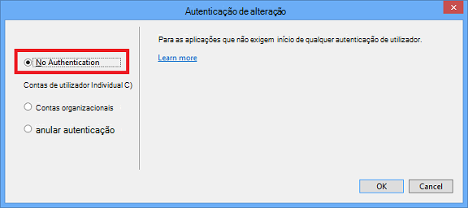

<properties
    pageTitle="Criar imagens no markdown"
    description="Explica como criar imagens no markdown de acordo com as diretrizes configurar para repositórios Azure."
    services=""
    solutions=""
    documentationCenter=""
    authors="kenhoff"
    manager="ilanas"
    editor="tysonn"/>

<tags
    ms.service="contributor-guide"
    ms.devlang=""
    ms.topic="article"
    ms.tgt_pltfrm=""
    ms.workload=""
    ms.date="06/25/2015"
    ms.author="kenhoff" />

# <a name="create-images-in-markdown"></a>Criar imagens no markdown

## <a name="image-folder-creation-and-link-syntax"></a>Sintaxe de criação e de ligação de pasta de imagem

Para um artigo de novo, terá de criar uma pasta das seguintes localizações:

    /articles/<service-directory>/media/<article-name>/

Por exemplo:

    /articles/app-service/media/app-service-enterprise-multichannel-apps/

Depois de criar a pasta e imagens adicionadas à mesma, utilize a seguinte sintaxe para criar imagens no artigo de:

```

```
Exemplo:

Consulte o artigo [o modelo de markdown](../markdown%20templates/markdown-template-for-new-articles.md) para obter um exemplo.  As ligações de referência de imagem neste modelo markdown foram concebidas para serem na parte inferior do modelo.

## <a name="guidelines-specific-to-azuremicrosoftcom"></a>Diretrizes específicas azure.microsoft.com

Capturas de ecrã são atualmente encorajadas se não é possível incluir passos para reprodução. Escreva o seu conteúdo para que o conteúdo pode realçar sem as capturas de ecrã se for necessário.

Utilize as seguintes diretrizes quando criar e ficheiros de ClipArt, incluindo:
- Não é partilhe ficheiros de ClipArt em documentos. Copie o ficheiro que necessita e adicioná-lo para a pasta de multimédia para o tópico específico. Partilha entre ficheiros não é aconselhada porque é mais fácil para remover preterida conteúdo e as imagens que mantém a repo limpo.

- Formatos de ficheiro: utilizar os ficheiros. PNG - são qualidade superior e manter a sua qualidade durante o processo de localização. Outros formatos de ficheiro não pretende manter a sua qualidade também. O formato JPEG é permitido, mas não preferido.  Não existem ficheiros GIF animados.

- Utilizar quadrados vermelhos da largura predefinida fornecidos do Paint (5 px) para chamar a atenção para elementos específicos no capturas de ecrã.  

    Exemplo:

    

- Quando faz sentido, à vontade recortar imagens para que os elementos da IU serão apresentados no tamanho máximo. Certifique-se de que o contexto é limpar aos utilizadores, embora.

- Evite espaço em branco no margens da capturas de ecrã. Se recortar uma captura de ecrã de uma forma que deixa fundo branco nas extremidades, adicione um limite de único pixel cinzenta à volta da imagem.  Se utilizar o Paint, utilize o cinzento mais claro a pallete de cor predefinida (0xC3C3C3). Se utilizar algumas outras app gráfico, a cor RGB é R195, G195, 195. Pode adicionar um limite à volta de uma imagem a cinzento facilmente no Visio – para fazer isto, selecione a imagem, selecione a linha e certifique-se da a cor correta está definido e, em seguida, altere a espessura da linha para pt 1 1/2.  Capturas de ecrã deverão ter um limite a cinzento pixel-toda a 1 para que áreas a branco da captura de ecrã esbater não para a página web.

    Exemplo:

    
    
    Para uma ferramenta ajudar a automatizar o processo de adicionar um limite necessário à imagens, consulte o artigo [AddACOMBorder ferramenta - como automatizar o processo de adicionar um limite de necessários 1 pixel cinzento imagens ACOM](https://github.com/Azure/Azure-CSI-Content-Tools/tree/master/Tools/AddACOMImageBorder).

- Imagens conceptuais com espaços em branco não necessita de um limite a cinzento.  

    Exemplo:

    

- Experimente não tornar uma imagem demasiado grande.  As imagens serão automaticamente redimensionadas se forem demasiado grandes. No entanto, o redimensionamento, por vezes provoca fuzziness, pelo que recomendamos que limitar a largura das imagens para 780 px e manualmente redimensionar imagens antes da submissão se for necessário.

- Mostre resultados de comando no capturas de ecrã.  Se um artigo inclui passos onde o utilizador está a funcionar dentro de uma shell, é útil mostrar saída do comando capturas de ecrã. Neste caso, restringir a largura da shell a cerca 72 carateres geralmente garante que a sua imagem permanecerá dentro a orientação de largura px 780. Antes de efetuar uma captura de ecrã de saída, redimensione a janela para que apenas o comando relevante e o resultado seja apresentado (opcionalmente com uma linha em branco em ambos os lados).

- Tomar capturas de ecrã inteiras do windows sempre que possível. Quando tomar a captura de ecrã da janela do browser, redimensione a janela do browser para 780 px grande ou menos e manter a altura da janela do browser como curtas possível tal que se adequa a aplicação dentro da janela.

    Exemplo:

    

- Cuidado com que as informações são reveladas no capturas de ecrã.  Não revele as informações da empresa interno ou informações pessoais.

- Arte concetual ou diagramas, utilize os ícones oficiais o nuvem e Enterprise símbolo e conjunto de ícones. Um conjunto público está disponível em http://aka.ms/CnESymbols.

- Substitua o texto do marcador entre parênteses em ângulo informações pessoais ou privadas no capturas de ecrã. Isto inclui os nomes de utilizador, IDs de subscrição e outras informações relacionadas. Podem ser substituídos nomes pessoais com uma [aprovado nome fictious](https://aka.ms/ficticiousnames)(ligação só de funcionário). Não utilize a sugestão lápis ou marcador do Paint para ocultem ou esbater informações pessoais ou privadas.

  A imagem seguinte foi atualizada corretamente para substituir o real **ID da subscrição** com informações de marcador de posição:

  

### <a name="contributors-guide-links"></a>Ligações de guia dos colaboradores

- [Artigo Descrição geral](./../README.md)
- [Índice de artigos de orientação](./contributor-guide-index.md)
