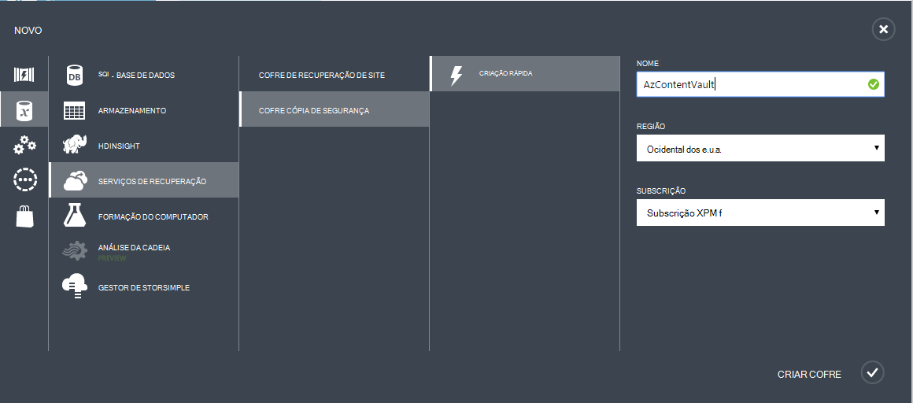
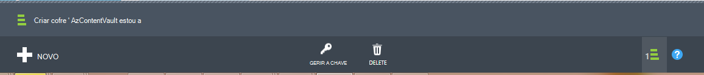

## Criar uma cópia de segurança Cofre
Para fazer cópia de segurança ficheiros e dados a partir do Windows Server ou Gestor de proteção de dados (DPM) para Azure ou quando a cópia IaaS VMs Azure, tem de criar uma cópia de segurança cofre na região geográfica onde pretende armazenar os dados.

Os passos seguintes irão guiá-lo através da criação de cofre utilizada para armazenar as cópias de segurança.

1. Inicie sessão no [Portal de gestão](https://manage.windowsazure.com/)
2. Clique em **Novo** > **Serviços de dados** > **Serviços de recuperação** > **Cofre de cópia de segurança** e selecione a **Criação rápida**.

    

3. Para o parâmetro **nome** , introduza um nome amigável para identificar o Cofre cópia de segurança. Isto tem de ser exclusivo para cada subscrição.

4. Para o parâmetro de **região** , selecione a região geográfica para a cópia de segurança cofre. A escolha determina a região geográfica à qual os seus dados de cópia de segurança são enviados. Ao selecionar uma região geográfica fechar para a sua localização, pode reduzir a latência da rede quando cópias de segurança Azure.

5. Clique em **Criar cofre** para concluir o fluxo de trabalho. Pode demorar algum tempo para o Cofre cópia de segurança criação de. Para verificar o estado, pode monitorizar as notificações na parte inferior do portal.

    

6. Depois de ter sido criado no cofre cópia de segurança, uma mensagem indica que o Cofre foi criado com êxito. O Cofre também está listado nos recursos para serviços de recuperação como **ativo**.

    

### Cópia de segurança Azure - opções de armazenamento de redundância

>[AZURE.IMPORTANT] A melhor hora para identificar a sua opção de redundância de armazenamento é à direita após a criação do cofre e antes de quaisquer máquinas estão registadas para o cofre. Assim que um item foi registado ao Cofre de palavras, a opção de redundância de armazenamento está bloqueada e não pode ser modificada.

As suas necessidades de negócio devem determinar a redundância de armazenamento de armazenamento de back-end a cópia de segurança do Azure. Se estiver a utilizar o Azure como um ponto final de armazenamento de cópia de segurança primário (por exemplo, é cópias de segurança para Azure a partir de um servidor do Windows), deverá tomar em consideração opção de armazenamento do Geo redundantes escolher (a predefinição). Isto é visualizado na opção de **Configurar** do Cofre de cópia de segurança.

#### Armazenamento geo redundantes (GRS)
GRS mantém seis cópias dos seus dados. Com GRS, os seus dados são replicados três vezes no interior da região principal e também são replicados três vezes numa região secundária centenas de milhas afastando-o a região principal, fornecer o nível mais alto de durabilidade. Em caso de falha na região principal, ao armazenar os dados na GRS, cópia de segurança do Azure assegura que os dados estiverem resistentes nas duas áreas em separado.

#### Armazenamento localmente redundante (LRS)
Armazenamento localmente redundante (LRS) mantém três cópias dos seus dados. LRS é replicada três vezes dentro de uma única funcionalidade numa única região. LRS protege os dados de falhas de normal hardware, mas não a partir de uma falha numa instalação Azure inteira.

Se estiver a utilizar o Azure como um ponto final de armazenamento de cópia de segurança superior (por exemplo, estiver a utilizar SCDPM para ter uma cópia de segurança local copiar no local e a utilização de Azure para necessita de retenção a longo prazo), deverá tomar em consideração escolhendo localmente armazenamento redundante a opção de **Configurar** do Cofre de cópia de segurança. Este procedimento traz para baixo o custo do armazenamento dos dados no Azure, fornecendo um nível inferior de durabilidade para os seus dados que podem ser aceitáveis para superior cópias ao mesmo.

