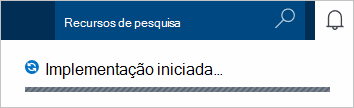
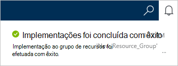
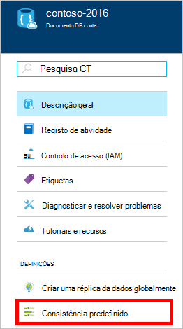
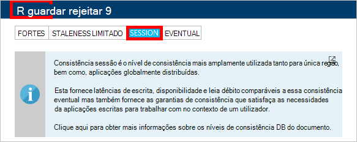

1.  Inicie sessão no [portal do Azure](https://portal.azure.com/).
2.  No Jumpbar, clique em **Novo**, clique em **dados + armazenamento**e, em seguida, clique em **DocumentDB (NoSQL)**.

      

3. Na pá **nova conta** , especifique a configuração da conta DocumentDB pretendida.

    

    - Na caixa **ID** , introduza um nome para identificar a conta DocumentDB.  Quando o **ID** for validado, aparece uma marca de verificação verde na caixa **ID** . O valor de **ID** torna-se o nome do anfitrião URI. O **ID de** pode conter apenas minúsculas, números bem como a '-' caráter e tem de estar entre 3 e 50 carateres. Tenha em atenção que *documents.azure.com* é anexado ao nome do ponto final que escolhe, o resultado que torna-se o ponto final de conta de DocumentDB.

    - Na caixa **NoSQL API** , selecione **DocumentDB**.  

    - Para a **subscrição**, selecione a subscrição Azure que pretende utilizar para a conta de DocumentDB. Se a sua conta tiver apenas uma subscrição, essa conta está selecionada por predefinição.

    - No **Grupo de recursos**, selecione ou crie um grupo de recursos para a sua conta DocumentDB.  Por predefinição, é criado um novo grupo de recursos. Para mais informações, consulte o artigo [utilizar o portal do Azure para gerir os seus recursos Azure](../articles/azure-portal/resource-group-portal.md).

    - Utilize a **localização** para especificar a localização geográfica em que a sua conta DocumentDB do anfitrião. 

4.  Depois das novas opções de conta DocumentDB estão configuradas, clique em **Criar**. Para verificar o estado da implementação, selecione o concentrador de notificações.  

      

    

5.  Quando a DocumentDB conta estiver criada, está pronto para ser utilizado com as definições predefinidas. A consistência predefinido da conta DocumentDB está definida para **sessão**.  Pode ajustar a consistência predefinido ao clicar em **Consistência predefinido** no menu do recurso. Para saber mais sobre os níveis de consistência oferecidos pelo DocumentDB, consulte o artigo [níveis de consistência no DocumentDB](../articles/documentdb/documentdb-consistency-levels.md).

      

      

[How to: Create a DocumentDB account]: #Howto
[Next steps]: #NextSteps
[documentdb-manage]:../articles/documentdb/documentdb-manage.md
