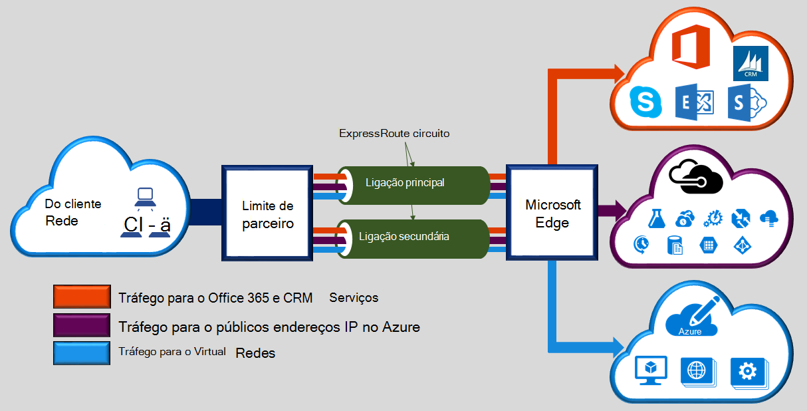

Microsoft Azure ExpressRoute permite-lhe expandir redes no local para a nuvem da Microsoft através de uma ligação privada dedicada facilitada por um fornecedor de conectividade. Com ExpressRoute, pode estabelecer ligações a serviços em nuvem Microsoft, como o Microsoft Azure, Office 365 e CRM Online. Conectividade pode ser a partir de uma rede (IP VPN) qualquer para qualquer, uma rede de Ethernet ponto a ponto ou uma ligação de publicação em virtual através de um fornecedor de conectividade a uma funcionalidade de cocriação localização. ExpressRoute ligações não aceda através da Internet pública. Esta opção permite-ligações ExpressRoute oferecer mais fiabilidade, velocidades mais rápidas, latências inferiores e superior segurança que as ligações típicas através da Internet.  

